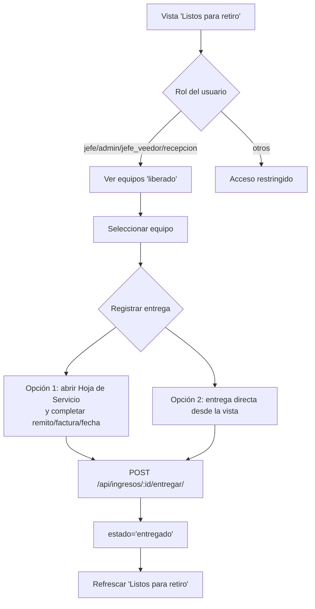

Manual del Sistema de Reparaciones

- Propósito
  - Documentar comportamientos funcionales, flujos, reglas y permisos del sistema.
  - Centraliza referencias a documentos específicos por tema.

- Roles y permisos
  - Roles: jefe, jefe_veedor, admin, recepcion, tecnico (fuente: `web/src/lib/authz.js`).
  - Accesos por vista (resumen): ver rutas protegidas en `web/src/main.jsx`.
  - Acciones críticas:
    - Liberar/imprimir remito: jefe, jefe_veedor, admin (UI); backend permite también recepción.
    - Aprobar/emitir presupuestos: jefatura.

- Estados y flujos
  - Estados de ticket (`ticket_state`, ver `sql/schema.sql`): ingresado, diagnosticado, presupuestado, reparar, reparado, liberado, entregado, baja, derivado, alquilado.
  - Estados de presupuesto (`quote_estado`, ver `sql/schema.sql`): pendiente, emitido, presupuestado, aprobado, rechazado, no_aplica.
  - Trigger sync quote→ingreso (`sql/schema.sql`): al aprobar presupuesto, si el ingreso estaba en ingresado/diagnosticado/presupuestado, pasa a reparar.

- Flujos principales
  - Ingreso de equipo: creación, accesorios, fotos (ver `docs/ingreso_fotos.md`).
  - Diagnóstico y resolución: se setea `resolucion` al cerrar reparación; también se autocompleta en impresión de remito si estado=‘reparado’.
  - Presupuestos: emitir/enviar, aprobar/rechazar, “no aplica”; ver pestaña Presupuesto de la Hoja de Servicio.
  - Reparación y liberación: botón de orden de salida (remito) que libera; entrega con remito/factura/fecha.
  - Derivaciones: crear, devolver; estados y unicidad de derivación abierta (ver `api/service/views/derivaciones_views.py`, `sql/ops/add_unique_open_derivacion_index.sql`).
  - Listos para retiro (liberados): listado operativo para marcar ENTREGADO.

- Operativa de remitos y presupuestos
  - Ver `docs/operativa_remitos_presupuestos.md`.
  - Incluye: botón en Aprobados, confirmación al aprobar si ya está reparado, autocompletado de resolución al imprimir, roles y manejo de errores.

- Pantallas y comportamientos (referencias)
  - Hoja de Servicio: `web/src/pages/ServiceSheet.jsx` (pestañas Principal, Diagnóstico, Presupuesto, Derivaciones, Historial).
  - Aprobados: `web/src/pages/Aprobados.jsx`.
  - Presupuestados: `web/src/pages/Presupuestados.jsx`.
  - Pendientes de Presupuesto: `web/src/pages/PendientesPresupuesto.jsx`.
  - Técnicos (mis pendientes): `web/src/pages/Tecnico.jsx`.
  - Listos/liberados/entregados: `web/src/pages/AdminListos.jsx` y endpoints relacionados.

## Comportamientos específicos

### Listos para retiro (AdminListos)
- Vista: `web/src/pages/AdminListos.jsx`.
- Fuente de datos: `GET /api/listos-para-retiro/` (alias de listados de liberados en backend).
- Orden: recientes primero por `fecha_entrega`/`fecha_listo`/`fecha_reparado`.
- Filtro: por OS, cliente, equipo, resolución, N/S.
- Acciones:
  - “Entregado”: POST `/api/ingresos/:id/entregar/` (en la Hoja de Servicio se requieren `remito_salida`/`factura`/`fecha_entrega`; desde la vista operativa, el backend valida lo necesario).
- Roles: ver rutas protegidas; usualmente recepción/admin/jefatura.

### Derivados
- Vistas: `web/src/pages/Derivados.jsx` y pestaña Derivaciones en la Hoja de Servicio.
- Crear derivación: `POST /api/ingresos/:id/derivar/`.
  - Reglas: una sola derivación abierta por ingreso (índice único condicional en `sql/ops/add_unique_open_derivacion_index.sql`).
  - Transición: `ingresos.estado` pasa a `derivado`.
- Remito de derivación (PDF): `GET /api/ingresos/:id/derivaciones/:deriv_id/remito/`.
- Devolver derivación: `POST /api/ingresos/:id/derivaciones/:deriv_id/devolver/`.
  - Transición: `ingresos.estado` vuelve a `ingresado`; notifica al técnico asignado por email (best-effort).
  - Historial: se etiqueta el último evento de vuelta a ‘ingresado’.

### Alertas de presupuestos pendientes (Jefe)
- Command: `python manage.py send_presupuesto_alerts`.
- Regla: primer aviso a los 7 dias desde `quotes.fecha_emitido`, luego cada 3 dias mientras siga "presupuestado".
- Destinatarios: usuarios activos con rol `jefe` (excluye `jefe_veedor`).
- Configuracion: `PRESUPUESTO_ALERT_ENABLED`, `PRESUPUESTO_ALERT_FIRST_DAYS`, `PRESUPUESTO_ALERT_REPEAT_DAYS`, `PRESUPUESTO_ALERT_LOCATION`.
- Requiere tabla: `python manage.py apply_presupuesto_alerts_schema`.
- Scheduling: ejecutar diario via cron/Task Scheduler (ej. 03:00).

### Mantenimientos preventivos (`/equipos`)
- UX:
  - La pantalla `/equipos` tiene 3 pestañas: `Equipos`, `Mantenimientos preventivos`, `Instituciones`.
  - `Equipos`: conserva la grilla historica original de equipos (mismo listado y acciones legacy).
  - `Mantenimientos preventivos`: muestra solo equipos (no instituciones) que tienen plan activo o tuvieron plan historico; incluye conteos (`Vencidos`, `Proximos`, `Sin plan`) y filtros por `estado` e `institucion`.
  - `Mantenimientos preventivos`: permite agregar equipo desde la lista de `Equipos` y crear equipo directo "sin ingreso" para inventario bajo tutela tecnica en institucion.
  - `Instituciones`: selector de institucion (customers), alta inline de institucion y flujo de revision institucional con continuidad.
- Reglas de estado:
  - `sin_plan`: no existe plan activo.
  - `vencido`: `hoy > proxima_revision_fecha`.
  - `proximo`: `hoy + aviso_anticipacion_dias >= proxima_revision_fecha` y no vencido.
  - `al_dia`: plan activo y no entra en `proximo/vencido`.
- Continuidad institucional:
  - Si hay borrador abierto, se retoma el mismo.
  - Nueva revision clona la ultima cerrada con `arrastrar_proxima=true` y agrega equipos nuevos del cliente en `pendiente`.
  - Para `retirado`, default operativo `arrastrar_proxima=false` (editable).
- Endpoints nuevos:
  - `GET /api/equipos/` (extendido con campos preventivos + filtros `preventivo_estado` y `con_plan`).
  - `POST /api/devices/alta-directa/` (alta de equipo sin generar ingreso).
  - `POST|PATCH /api/equipos/<device_id>/preventivo-plan/`.
  - `POST /api/equipos/<device_id>/preventivo-revisiones/`.
  - `GET /api/preventivos/agenda/` (soporta `scope`, `estado`, `customer_id`, `q`, `only_with_plan`).
  - `GET /api/preventivos/clientes/`.
  - `POST|PATCH /api/clientes/<customer_id>/preventivo-plan/`.
  - `GET|POST /api/clientes/<customer_id>/preventivo-revisiones/`.
  - `GET /api/preventivos/revisiones/<revision_id>/`.
  - `POST /api/preventivos/revisiones/<revision_id>/items/`.
  - `PATCH /api/preventivos/revisiones/<revision_id>/items/<item_id>/`.
  - `POST /api/preventivos/revisiones/<revision_id>/cerrar/`.
- Esquema:
  - Fuente de verdad en `sql/schema.sql` (enums + tablas `preventivo_planes`, `preventivo_revisiones`, `preventivo_revision_items`, indices y triggers).
  - Aplicacion en bases desplegadas: `python manage.py apply_preventivos_schema`.
- Alertas diarias por email:
  - Command: `python manage.py send_preventivo_alerts [--dry-run] [--limit N]`.
  - Destinatarios: usuarios activos con `rol='jefe'`.
  - Configuracion: `PREVENTIVO_ALERT_ENABLED`, `PREVENTIVO_DEFAULT_LEAD_DAYS`.
  - Scheduling: diario (cron/Task Scheduler), mismo patron que presupuestos.

- PDFs y reportes
  - Presupuesto PDF: `api/service/pdf.py` + endpoints en `api/service/views/quotes_views.py`.
  - Remito de salida: `api/service/views/reportes_views.py` (autocompleta resolución si estado=‘reparado’ y libera).
  - Remito de derivación: `render_remito_derivacion_pdf` en `api/service/pdf.py` y endpoint asociado.
  - Informe de test tecnico: `GET /api/ingresos/<id>/test/pdf/` (usa `references_snapshot` persistido para trazabilidad estable).

- Test tecnico por tipo de equipo
  - Pestaña `Test` en Hoja de Servicio con protocolo dinamico por `tipo_equipo`.
  - Esquema: `python manage.py apply_test_schema` (crea/actualiza `ingreso_tests`).
  - Endpoints:
    - `GET /api/ingresos/<id>/test/`
    - `PATCH /api/ingresos/<id>/test/`
    - `GET /api/ingresos/<id>/test/pdf/`
  - Cada protocolo incluye referencias tecnicas (`REF-xx`) visibles en frontend y PDF.
  - `references_snapshot` se congela al guardar para evitar cambios retroactivos en informes ya emitidos.

- Auditoría y eventos
  - Tabla `ingreso_events`: registra transición a ‘liberado’ en impresión (una sola vez).
  - Historial por ingreso: `api/service/views/ingresos_views.py` (endpoint `.../historial/`).
  - Ver `docs/AUDITORIA.md` para el diseño completo (change_log vs ingreso_events vs audit_log) y activación de triggers adicionales.

- Catálogos y datos
  - Marcas, modelos, tipos y variantes; asignación de técnicos por marca/modelo.
  - Ver endpoints en `api/service/urls.py` y vistas en `api/service/views`.

- Configuración
  - Variables de entorno: ver `.env`, `.env.prod`.
  - Deploy: `docker-compose*.yml`, `nginx.conf`.

- Glosario
  - OS: Orden de Servicio (ID de ingreso).
  - Remito: Orden de salida (PDF de liberación/entrega).
  - Resolución: resultado de la reparación (reparado, no_reparado, no_se_encontro_falla, presupuesto_rechazado).

## Diagramas de flujo

### Liberación y entrega
```mermaid
flowchart TD
  A[Equipo listo] --> B{Imprimir remito?}
  B -- Sí (desde Hoja o Aprobados) --> C[GET /ingresos/:id/remito/]
  C --> D[Backend verifica resolución; si reparado y vacía => set 'reparado']
  D --> E[Marca estado='liberado' y registra evento]
  E --> F[PDF en frontend]
  F --> G[Listos para retiro]
  G --> H[Entrega (remito/factura/fecha)]
  H --> I[POST /ingresos/:id/entregar/] --> J[estado='entregado']
```

### Listos para retiro (roles y flujo)


### Derivaciones
```mermaid
flowchart TD
  A[Derivar ingreso] --> B[POST /ingresos/:id/derivar/]
  B --> C{Existe derivación abierta?}
  C -- Sí --> D[409 con deriv_id]
  C -- No --> E[Creación derivación y estado='derivado']
  E --> F[Remito derivación (opcional) GET /ingresos/:id/derivaciones/:deriv/remito/]
  F --> G[Servicio externo]
  G --> H[Devolver derivación]
  H --> I[POST /ingresos/:id/derivaciones/:deriv/devolver/]
  I --> J[estado='ingresado' + notificar técnico (best-effort)]
```

### Baja / Alta desde Hoja de Servicio
- Baja: `POST /api/ingresos/:id/baja/`.
  - Cambia a estado `baja`.
  - Setea ubicacion `-`.
  - Envia email a `BAJA_NOTIFY_RECIPIENTS` (best-effort).
- Alta: `POST /api/ingresos/:id/alta/` (solo si el estado actual es `baja`).
  - Cambia a estado `ingresado`.
  - Setea ubicacion `Taller`.
  - Envia email a `BAJA_NOTIFY_RECIPIENTS` (best-effort).
