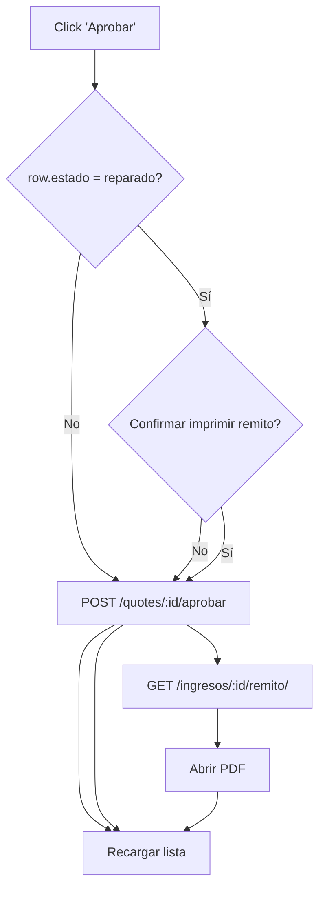

Operativa de remitos y presupuestos

- Pantalla Aprobados (web/src/pages/Aprobados.jsx)
  - Columna removida: “Fecha ingreso”.
  - Botón “Imprimir remito” por fila solo cuando:
    - El estado del ingreso es `reparado`.
    - El usuario tiene rol con permiso de liberar: `jefe`, `jefe_veedor`, `admin` (helper `canRelease`).
  - Acción del botón:
    - Abre `/api/ingresos/:id/remito/` en una nueva pestaña (PDF).
    - Tras imprimir, recarga la lista; el ingreso pasa a `liberado` y puede dejar de mostrarse en Aprobados.

- Confirmación al aprobar presupuesto si el equipo ya está reparado
  - Presupuesto en Hoja de Servicio (web/src/pages/ServiceSheet.jsx)
    - Al hacer “Aprobar presupuesto”, si `estado === "reparado"` se pregunta:
      “Este equipo ya está reparado, ¿imprimir remito de salida?”
    - Si se acepta: se aprueba el presupuesto, se abre el remito en PDF y se refresca el ingreso (queda `liberado`).
    - Si se cancela: solo se aprueba el presupuesto (comportamiento tradicional).
  - Lista de Presupuestados (web/src/pages/Presupuestados.jsx)
    - Al “Aprobar” una fila con `estado === "reparado"`, se muestra la misma confirmación y, al aceptar, se imprime el remito.
    - Luego se actualiza la lista.

- Comportamiento backend al imprimir remito (api/service/views/reportes_views.py)
  - Endpoint: `GET /api/ingresos/<ingreso_id>/remito/` (RemitoSalidaPdfView).
  - Si el ingreso está en `reparado` y la `resolucion` está vacía, se autocompleta `resolucion = 'reparado'` antes de generar el PDF.
  - Si sigue faltando resolución y el estado no es `liberado`, se devuelve 409 (bloquea imprimir).
  - Al imprimir exitosamente, se marca el ingreso como `liberado` (si no estaba `entregado`) y se registra el evento (una sola vez).

- Roles y permisos
  - Frontend (botón en Aprobados): visible solo para `canRelease` → `jefe`, `jefe_veedor`, `admin`.
  - Backend (endpoint remito): permitido a `jefe`, `admin`, `recepcion`, `jefe_veedor`.
    - Nota: por diseño de UI, Recepción no ve el botón en Aprobados. Si se desea, puede agregarse visibilidad también para Recepción.
  - Aprobación de presupuesto: accesible para jefatura (Hoja de Servicio y lista de Presupuestados).

- Sincronización de estado por trigger (sql/schema.sql)
  - Cuando la `quote` cambia de estado a `aprobado`, el trigger `sync_quote_with_ingreso` actualiza `presupuesto_estado` y, si el estado actual del ingreso es uno de `ingresado/diagnosticado/presupuestado`, pasa a `reparar`.
  - Si el equipo ya estaba `reparado`, el trigger conserva el estado actual (no lo retrocede).

- Consideraciones de UX/errores
  - Si la apertura del PDF falla, se muestra un error y el usuario puede intentar imprimir luego desde la hoja de servicio o desde Aprobados.
  - Tras imprimir, la Hoja de Servicio se refresca (cuando aplica) para reflejar el paso a `liberado`.

- Referencias rápidas (archivos)
  - Aprobados: `web/src/pages/Aprobados.jsx`
  - Hoja de Servicio (Presupuesto): `web/src/pages/ServiceSheet.jsx`
  - Presupuestados (lista): `web/src/pages/Presupuestados.jsx`
  - Endpoint remito: `api/service/views/reportes_views.py`
  - Trigger de sincronización: `sql/schema.sql`

## Diagramas de flujo

### Aprobados: botón “Imprimir remito”
```mermaid
flowchart TD
  A[Usuario con rol liberar<br/>(jefe/jefe_veedor/admin)] --> B{Fila estado = reparado?}
  B -- No --> Z[No mostrar botón]
  B -- Sí --> C[Click 'Imprimir remito']
  C --> D[GET /api/ingresos/:id/remito/]
  D --> E{resolución vacía y estado reparado?}
  E -- Sí --> F[SET resolucion='reparado']
  E -- No --> G
  F --> G{resolución presente o estado liberado?}
  G -- No --> H[409: falta resolución]
  G -- Sí --> I[UPDATE estado='liberado' + registrar evento]
  I --> J[Generar PDF]
  J --> K[Frontend abre PDF y refresca lista]
```

### Hoja de Servicio (Presupuesto): aprobar + imprimir si ya está reparado
```mermaid
flowchart TD
  A[Click 'Aprobar presupuesto'] --> B{estado actual = reparado?}
  B -- No --> C[POST /quotes/:id/aprobar] --> D[Actualizar estado presupuesto] --> X[Fin]
  B -- Sí --> E{Confirmar imprimir remito?}
  E -- No --> C
  E -- Sí --> C --> F[GET /ingresos/:id/remito/]
  F --> G[Abrir PDF] --> H[Refrescar ingreso (pasa a liberado)]
```

### Presupuestados (lista): aprobar + imprimir si ya está reparado

